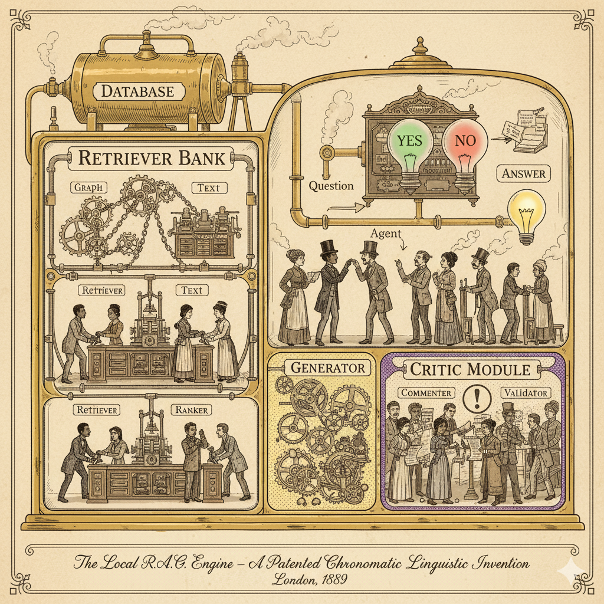

# 🚀 Local RAG Pipeline

<div align="center">

[](https://www.python.org/downloads/)
[](https://opensource.org/licenses/MIT)
[](http://makeapullrequest.com)

**A production-ready RAG pipeline combining vector search and knowledge graphs for intelligent document interaction**

[Features](#-features) • [Quick Start](#-quick-start) • [Documentation](#-documentation) • [Examples](#-examples) • [Contributing](#-contributing)

</div>

---


## 🎯 What is This?

A **fully local, privacy-focused** Retrieval-Augmented Generation (RAG) pipeline that lets you chat with your documents using AI. No external APIs, no data leaving your machine.

### Why This Exists

Most RAG solutions either:
- 📡 Send your data to external APIs (privacy concerns)
- 🔍 Use only vector search (missing relationships)
- 🧩 Are incomplete (no persistence, poor documentation)

**This pipeline solves all three:**
- 🔒 **100% Local**: Everything runs on your machine
- 🕸️ **Hybrid Search**: Vector similarity + Knowledge graph relationships
- 📦 **Production Ready**: Complete with persistence, error handling, and extensive documentation

---

## ✨ Features

### Core Capabilities
- 🔍 **Hybrid Search Engine**
  - FAISS vector similarity search
  - NetworkX knowledge graph relationships
  - Intelligent fusion of both approaches

- 📚 **Multi-Format Support**
  - PDF, DOCX, TXT, Markdown, CSV
  - Automatic chunking and preprocessing
  - Metadata preservation

- 🤖 **Local LLM Integration**
  - HuggingFace Transformers
  - Customizable models (phi-2, Mistral, Llama, etc.)
  - Streaming support ready

- 💾 **Persistence Layer**
  - Save/load indices
  - Portable between machines
  - Incremental updates supported

### User Experience
- 💬 **Interactive CLI** - Chat with your documents
- 🐍 **Python API** - Programmatic access
- 📓 **Jupyter Notebook** - Interactive exploration
- ⚙️ **Easy Configuration** - Single config file

---

## 🚀 Quick Start

### Installation

```bash
# Clone the repository
git clone https://github.com/yourusername/local-rag-pipeline.git
cd local-rag-pipeline

# Run automated setup
chmod +x setup.sh
./setup.sh
```

Or manually:

```bash
# Create virtual environment
python -m venv venv
source venv/bin/activate  # On Windows: venv\Scripts\activate

# Install dependencies
pip install -r requirements.txt
```

### Usage

**1. Prepare Your Documents**
```bash
mkdir my_documents
cp /path/to/your/documents/* my_documents/
```

**2. Initialize the Pipeline**
```bash
python src/rag_interface.py --documents ./my_documents
```

**3. Start Asking Questions!**
```
[HYBRID] 💬 You: What are the main topics in my documents?

🔍 Searching...

🤖 Answer:
The main topics include machine learning fundamentals, neural network 
architectures, and practical applications of AI...

📚 Sources:
1. ml_guide.pdf
2. neural_networks.docx
```

---

## 📖 Documentation

| Document | Description |
|----------|-------------|
| [Getting Started](docs/GETTING_STARTED.md) | Step-by-step setup guide |
| [User Guide](docs/USER_GUIDE.md) | Complete usage documentation |
| [Architecture](docs/ARCHITECTURE.md) | Technical architecture details |
| [API Reference](docs/API_REFERENCE.md) | Python API documentation |
| [Configuration](docs/CONFIGURATION.md) | Configuration options |
| [Troubleshooting](docs/TROUBLESHOOTING.md) | Common issues and solutions |

---

## 💡 Examples

### Command Line Interface
```bash
# Interactive mode
python src/rag_interface.py

# Single query
python src/rag_interface.py --query "What is machine learning?"

# Custom models
python src/rag_interface.py \
    --embedding-model all-mpnet-base-v2 \
    --llm-model mistralai/Mistral-7B-Instruct-v0.1
```

### Python API
```python
from src.rag_pipeline import LocalRAGPipeline

# Initialize
rag = LocalRAGPipeline(
    embedding_model="all-MiniLM-L6-v2",
    llm_model="microsoft/phi-2"
)

# Load documents
documents = rag.load_documents("./my_documents")
rag.build_vector_index(documents)
rag.build_knowledge_graph(documents)

# Query
result = rag.query(
    "What are the key concepts?",
    search_type="hybrid",
    top_k=5
)

print(result['answer'])
```

### Jupyter Notebook
```bash
jupyter notebook examples/rag_notebook.ipynb
```

See [examples/](examples/) for more detailed examples.

---

## 🏗️ Architecture

```
┌─────────────────────────────────────────────────────────┐
│                    Your Documents                        │
│              (PDF, DOCX, TXT, MD, CSV)                  │
└────────────────────┬────────────────────────────────────┘
                     │
                     ▼
        ┌────────────────────────────────┐
        │   Document Loader & Chunker     │
        └────────────┬───────────────────┘
                     │
         ┌───────────┴──────────┐
         ▼                      ▼
  ┌─────────────┐        ┌──────────────┐
  │ Vector Index│        │Knowledge Graph│
  │   (FAISS)   │        │  (NetworkX)   │
  └──────┬──────┘        └───────┬──────┘
         │                       │
         └──────────┬────────────┘
                    ▼
           ┌────────────────┐
           │ Hybrid Search  │
           │   & Reranking  │
           └────────┬───────┘
                    ▼
           ┌────────────────┐
           │   Local LLM    │
           │Answer Generation│
           └────────────────┘
```

---

## 🛠️ Technology Stack

| Component | Technology |
|-----------|-----------|
| **Embeddings** | Sentence-Transformers |
| **Vector Store** | FAISS |
| **Knowledge Graph** | NetworkX |
| **LLM** | HuggingFace Transformers |
| **Document Loaders** | LangChain Community |
| **Framework** | Python 3.8+ |

---

## ⚙️ Configuration

Edit `src/config.py` to customize:

```python
# Model Selection
EMBEDDING_MODEL = "all-MiniLM-L6-v2"  # Fast, lightweight
LLM_MODEL = "microsoft/phi-2"          # Small but capable

# Search Configuration
DEFAULT_SEARCH_TYPE = "hybrid"  # vector, graph, or hybrid
VECTOR_WEIGHT = 0.7  # Weight for vector search
GRAPH_WEIGHT = 0.3   # Weight for graph search

# Performance
CHUNK_SIZE = 500
CHUNK_OVERLAP = 50
USE_GPU = True
```

---

## 📊 Performance

### Default Configuration
- **Embedding Model**: all-MiniLM-L6-v2 (~80MB)
- **LLM**: microsoft/phi-2 (~5GB)
- **RAM Usage**: ~8GB
- **Query Speed**: 2-5 seconds (CPU), 0.5-1 second (GPU)

### Optimization Tips
- **Speed**: Use smaller models, GPU acceleration, larger chunks
- **Quality**: Use larger models, smaller chunks, increase top_k
- **Scale**: Use IVF FAISS index, implement batching

---

## 🔒 Privacy & Security

✅ **100% Local Processing** - No external API calls  
✅ **No Data Collection** - Your documents stay on your machine  
✅ **Open Source** - Fully auditable code  
✅ **Offline Capable** - Works without internet (after model download)  
✅ **Encrypted Storage** - Compatible with encrypted filesystems  

---

## 🧪 Testing

```bash
# Run tests
python -m pytest tests/

# Run specific test
python -m pytest tests/test_pipeline.py

# With coverage
python -m pytest --cov=src tests/
```

---

## 🗺️ Roadmap

- [ ] Advanced entity extraction with spaCy NER
- [ ] Cross-encoder reranking
- [ ] Multi-modal support (images, tables)
- [ ] Web UI with Gradio
- [ ] RESTful API server
- [ ] Docker containerization
- [ ] Incremental indexing
- [ ] Multi-language support

See [ROADMAP.md](docs/ROADMAP.md) for details.

---

## 🤝 Contributing

Contributions are welcome! Please see [CONTRIBUTING.md](CONTRIBUTING.md) for guidelines.

### Ways to Contribute
- 🐛 Report bugs
- 💡 Suggest features
- 📖 Improve documentation
- 🔧 Submit pull requests
- ⭐ Star the repository

---

## 📄 License

This project is licensed under the MIT License - see [LICENSE](LICENSE) for details.

---

## 🙏 Acknowledgments

Built with:
- [Sentence-Transformers](https://www.sbert.net/) for embeddings
- [FAISS](https://github.com/facebookresearch/faiss) for vector search
- [NetworkX](https://networkx.org/) for knowledge graphs
- [HuggingFace Transformers](https://huggingface.co/transformers/) for LLMs
- [LangChain](https://github.com/langchain-ai/langchain) for document loaders

---

## 📞 Support

- 📖 [Documentation](docs/)
- 💬 [Discussions](https://github.com/yourusername/local-rag-pipeline/discussions)
- 🐛 [Issue Tracker](https://github.com/yourusername/local-rag-pipeline/issues)

---

## 🌟 Star History

If you find this project useful, please consider giving it a star! ⭐

---

<div align="center">

**Built with ❤️ for privacy-conscious developers**

[⬆ back to top](#-local-rag-pipeline)

</div>
